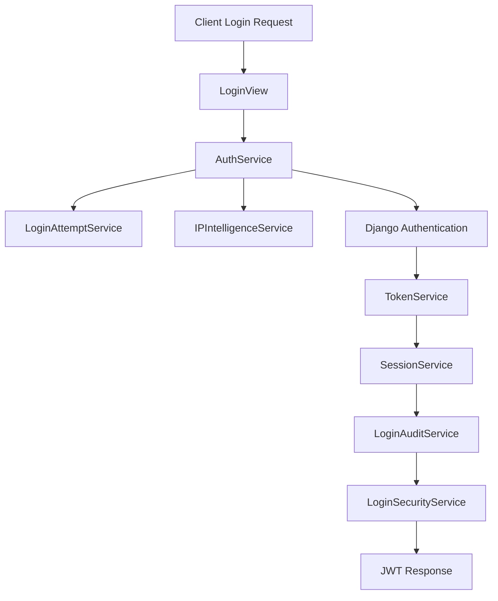
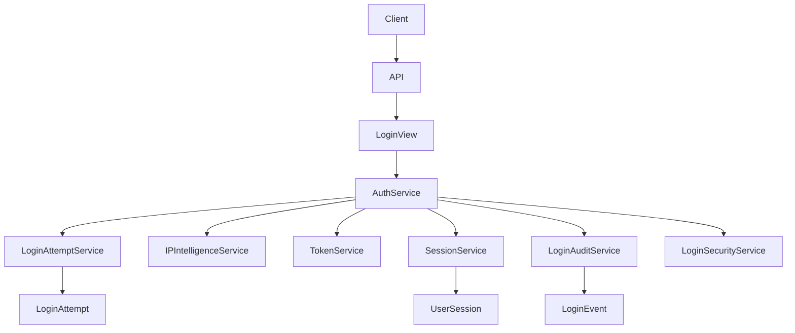
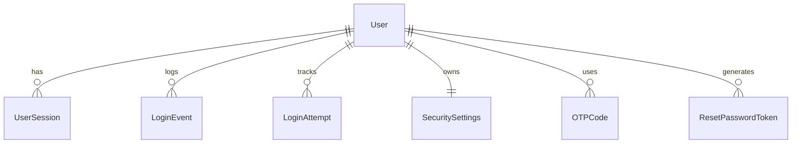
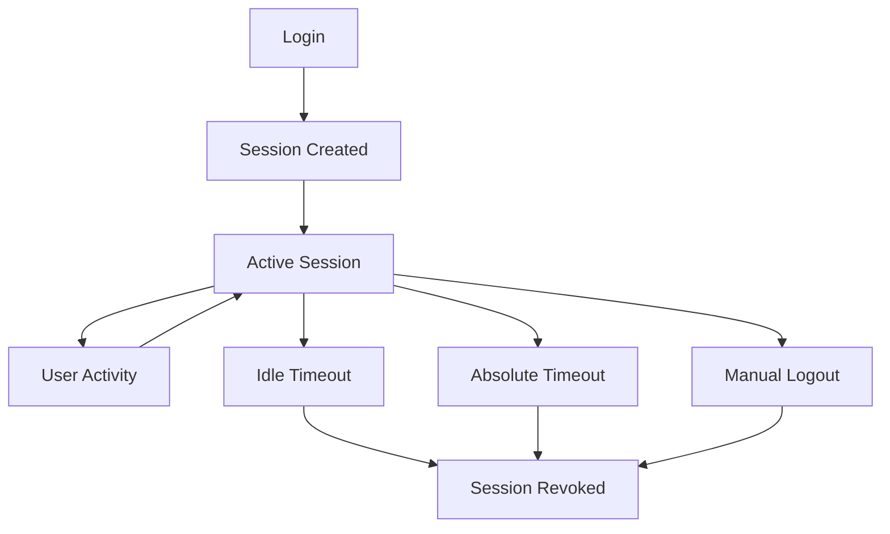
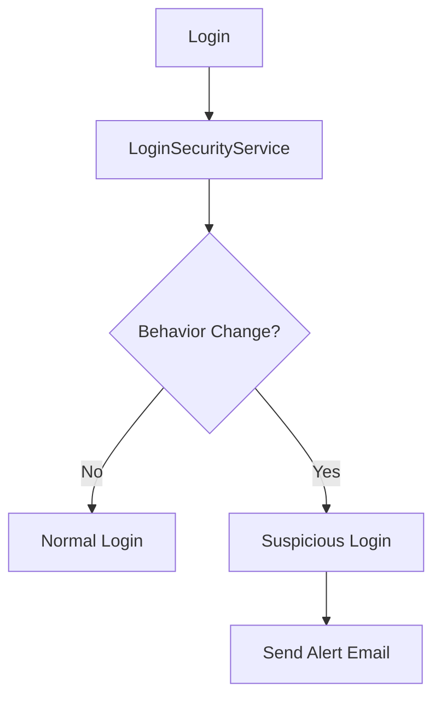

# Authentication Diagrams
Veloma App

---

# Overview

This document contains visual diagrams explaining the architecture and flow of the authentication module.

Diagrams include:

• login flow  
• authentication architecture  
• service interaction  
• database models  
• session lifecycle  

These diagrams help developers understand the system quickly.

---

# Login Flow Diagram

ASCII Diagram

```
Client
   │
   ▼
POST /api/v1/auth/login
   │
   ▼
LoginView
   │
   ▼
AuthService
   │
   ├── LoginAttemptService
   │
   ├── IPIntelligenceService
   │
   ├── Django authenticate()
   │
   ├── TokenService
   │
   ├── SessionService
   │
   ├── LoginAuditService
   │
   └── LoginSecurityService
   │
   ▼
Response (JWT tokens)
```

---

# Login Flow (Mermaid)



---

# Service Architecture

ASCII Representation

```
Authentication Module

            AuthService
                 │
                 ▼
        ┌─────────────────┐
        │   SessionService │
        └─────────────────┘
                 │
                 ▼
           UserSession

        ┌─────────────────┐
        │   TokenService   │
        └─────────────────┘

        ┌─────────────────┐
        │ LoginAttemptSvc │
        └─────────────────┘

        ┌─────────────────┐
        │ LoginAuditSvc   │
        └─────────────────┘

        ┌─────────────────┐
        │ LoginSecuritySvc│
        └─────────────────┘
```

---

# Authentication Architecture (Mermaid)



---

# Database Model Relationships

ASCII Diagram

```
User
 │
 ├── SecuritySettings
 │
 ├── UserSession
 │
 ├── LoginEvent
 │
 ├── LoginAttempt
 │
 ├── OTPCode
 │
 └── ResetPasswordToken
```

---

# Database Model Diagram (Mermaid)



---

# Session Lifecycle

ASCII Diagram

```
Login
 │
 ▼
Session Created
 │
 ▼
Active Session
 │
 ├── Activity → last_seen updated
 │
 ├── Idle Timeout
 │
 ├── Absolute Timeout
 │
 └── Manual Revocation
 │
 ▼
Session Revoked
```

---

# Session Lifecycle (Mermaid)



---

# Suspicious Login Detection Flow

ASCII Diagram

```
Login Occurs
   │
   ▼
LoginSecurityService
   │
   ▼
Compare with previous login
   │
   ├── Same behavior → Normal login
   │
   └── Behavior changed
          │
          ▼
     Suspicious Login
          │
          ▼
     Send Email Alert
```

---

# Suspicious Login Flow (Mermaid)



---

# Security Layers Diagram

```
User Request
     │
     ▼
Layer 1
Brute Force Protection

     ▼
Layer 2
IP Intelligence

     ▼
Layer 3
Session Management

     ▼
Layer 4
Suspicious Login Detection

     ▼
Layer 5
Security Alerts
```

---

# Conclusion

These diagrams illustrate how the authentication module is structured and how its components interact.

Understanding these flows helps developers:

• debug authentication issues  
• extend the security system  
• onboard new developers faster  

---