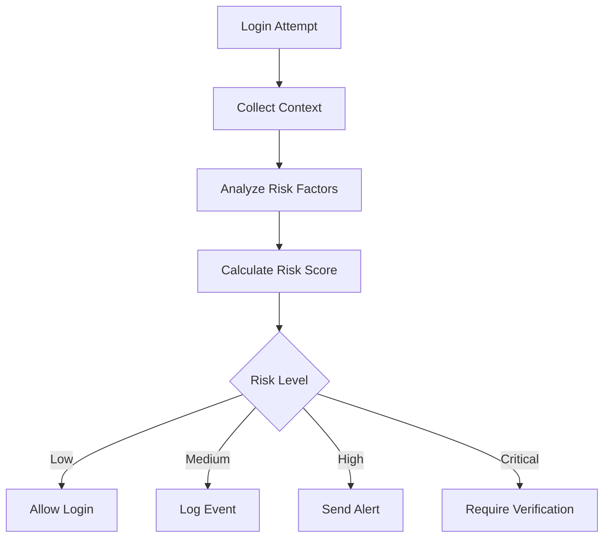

# 🎯 Authentication Risk Engine
Veloma App

---

# Overview

The **Risk Engine** is responsible for calculating the risk level of each login attempt.

Instead of treating every login equally, the system evaluates multiple signals and assigns a **risk score**.

This allows the authentication system to:

• detect suspicious login attempts  
• trigger security alerts  
• enforce additional verification  
• protect user accounts from unauthorized access  

The risk engine works together with:

LoginSecurityService  
IPIntelligenceService  
SessionService  

---

# Risk Scoring Concept

Every login receives a **risk score**.

Example scale:

| Score | Risk Level |
|------|-------------|
0–20 | Low risk |
21–50 | Medium risk |
51–70 | High risk |
71–100 | Critical risk |

Example login context:

```
IP: 185.x.x.x
Country: PT
Browser: Chrome
Device: Desktop
Risk Score: 10
```

Result:

```
LOW RISK
```

---

# Risk Factors

The system evaluates several parameters.

Each parameter contributes to the final risk score.

---

# IP Reputation

Source:

```
IPIntelligenceService
```

Checks include:

• datacenter IP  
• proxy network  
• VPN  
• TOR exit node  

Example:

| Condition | Score |
|-----------|------|
Datacenter IP | +20 |
VPN detected | +30 |
TOR node | +50 |

---

# Geographic Change

If the login occurs from a new country.

Example:

```
Previous login: Portugal
Current login: Russia
```

Risk increase:

```
+30
```

---

# IP Address Change

If the login IP changes significantly.

Example:

```
Previous IP: 185.44.x.x
Current IP: 95.102.x.x
```

Risk increase:

```
+10
```

---

# Device Change

If the device differs from previous login.

Example:

```
Previous device: Windows Desktop
Current device: iPhone
```

Risk increase:

```
+20
```

---

# Browser Change

Example:

```
Previous: Chrome
Current: Firefox
```

Risk increase:

```
+10
```

---

# Operating System Change

Example:

```
Previous: Windows
Current: Linux
```

Risk increase:

```
+10
```

---

# New Device Detection

If device_hash has never been seen before.

Risk increase:

```
+25
```

---

# Impossible Travel Detection

Example scenario:

```
Login 1:
Portugal – 10:00

Login 2:
Japan – 10:05
```

Travel time is physically impossible.

Risk increase:

```
+80
```

This indicates possible account compromise.

---

# Risk Score Calculation

Example calculation.

Login context:

```
New country
New device
VPN detected
```

Score calculation:

```
Country change = +30
Device change = +20
VPN = +30

Total = 80
```

Result:

```
CRITICAL RISK
```

---

# Risk-Based Actions

The system can respond differently depending on risk score.

| Risk Level | Action |
|-------------|--------|
Low | Allow login |
Medium | Log event |
High | Send alert email |
Critical | Require additional verification |

Example:

```
Risk score = 75
Action = Send security alert
```

---

# Integration With LoginSecurityService

Risk scoring is evaluated inside:

```
LoginSecurityService
```

Example logic:

```
if risk_score >= 70:
    suspicious = True
```

Then:

```
send_alert(user)
```

---

# Example Risk Engine Flow

```
Login Attempt
      │
      ▼
Collect Login Context
      │
      ▼
Analyze Risk Factors
      │
      ▼
Calculate Risk Score
      │
      ▼
Evaluate Threshold
      │
      ▼
Apply Security Action
```

---

# Mermaid Diagram



---

# Future Improvements

The risk engine can be enhanced with:

Behavioral analysis

Machine learning anomaly detection

Adaptive authentication

User behavior baselines

Device fingerprint strengthening

---

# Example Future Features

Possible extensions include:

Device trust score

User behavior modeling

Adaptive MFA

Geo velocity detection

---

# Security Philosophy

The risk engine follows a **risk-based authentication approach**.

This means:

Normal behavior → smooth login experience

Suspicious behavior → stronger verification

This balances:

• security  
• usability  

---

# Summary

The Risk Engine improves authentication security by:

• analyzing login context  
• calculating risk scores  
• triggering appropriate responses  

This approach enables the system to detect suspicious access attempts and protect user accounts effectively.

---